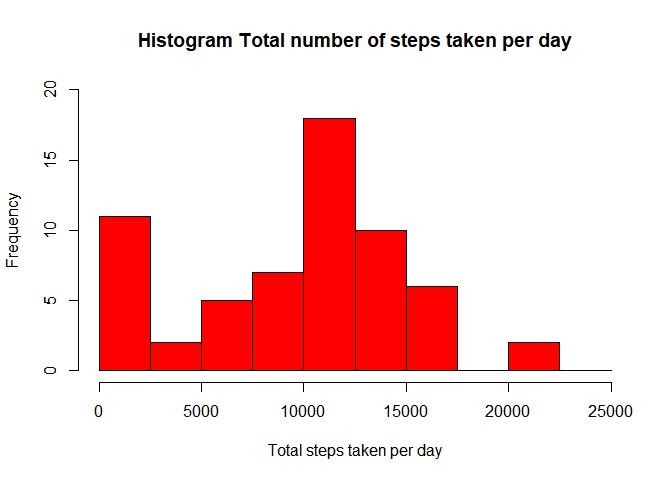
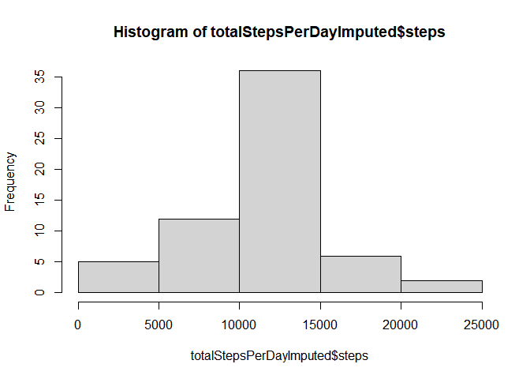
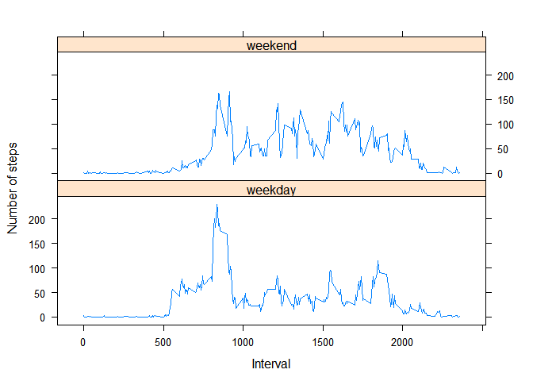

  <h4><br/>Introduction</h4>
  
  <br/>It is now possible to collect a large amount of data about personal movement using activity monitoring devices such as a Fitbit, Nike Fuelband, or Jawbone Up. These type of devices are part of the “quantified self” movement – a group of enthusiasts who take measurements about themselves regularly to improve their health, to find patterns in their behavior, or because they are tech geeks. But these data remain under-utilized both because the raw data are hard to obtain and there is a lack of statistical methods and software for processing and interpreting the data.

<br/>This assignment makes use of data from a personal activity monitoring device. This device collects data at 5 minute intervals through out the day. The data consists of two months of data from an anonymous individual collected during the months of October and November, 2012 and include the number of steps taken in 5 minute intervals each day.

```r
setwd("C:/Users/ABM/Desktop/Data Science/Reproducible Research")
knitr::opts_chunk$set(warning=FALSE)
library(ggplot2)
activityData <- read.csv("./activity.csv")
summary(activityData)
```

```
##      steps            date              interval     
##  Min.   :  0.00   Length:17568       Min.   :   0.0  
##  1st Qu.:  0.00   Class :character   1st Qu.: 588.8  
##  Median :  0.00   Mode  :character   Median :1177.5  
##  Mean   : 37.38                      Mean   :1177.5  
##  3rd Qu.: 12.00                      3rd Qu.:1766.2  
##  Max.   :806.00                      Max.   :2355.0  
##  NA's   :2304
```
<h5><br/>1. What is mean total number of steps taken per day?</h5>
  <br/>Make a histogram of the total number of steps taken each day

```r
activity_total_steps <- with(activityData, aggregate(steps, by = list(date), FUN = sum, na.rm = TRUE))
names(activity_total_steps) <- c("date", "steps")
hist(activity_total_steps$steps, main = "Histogram Total number of steps taken per day", xlab = "Total steps taken per day", col = "red", ylim = c(0,20), breaks = seq(0,25000, by=2500))
```

<!-- -->
<br/>Calculate the total number of steps taken per day

```r
totalStepsperDay <- sum(activity_total_steps$steps)
totalStepsperDay
```

```
## [1] 570608
```
<br/>Calculate and report the mean and median of the total number of steps taken per day

```r
meanStepsperDay <- mean(activity_total_steps$steps)
medianStepsperDay <- median(activity_total_steps$steps)
```
<br/>Mean of the total number of steps taken per day

```r
meanStepsperDay
```

```
## [1] 9354.23
```
<br/>Median of the total number of steps taken per day

```r
medianStepsperDay
```

```
## [1] 10395
```
<h5><br/>2. What is the average daily activity pattern?</h5>
  <br>Make a time series plot (i.e. 𝚝𝚢𝚙𝚎 = “𝚕”) of the 5-minute interval (x-axis) and the average number of steps taken, averaged across all days (y-axis)

```r
stepsPerInterval<-aggregate(steps~interval, data=activityData, mean, na.rm=TRUE)
plot(steps~interval, data=stepsPerInterval, type="l")
```

<!-- -->
<br>Which 5-minute interval, on average across all the days in the dataset, contains the maximum number of steps?
  
  ```r
  intervalwithMaxSteps <- stepsPerInterval[which.max(stepsPerInterval$steps), ]$interval
  intervalwithMaxSteps
  ```
  
  ```
  ## [1] 835
  ```
<h5><br/>Imputing missing values</h5>
  <br>Calculate and report the total number of missing values in the dataset (i.e. the total number of rows with N𝙰s)

```r
MissingValues <- sum(is.na(activityData$steps))
MissingValues
```

```
## [1] 2304
```
<br>Devise a strategy for filling in all of the missing values in the dataset. The strategy does not need to be sophisticated. For example, you could use the mean/median for that day, or the mean for that 5-minute interval, etc.

```r
getMeanStepsPerInterval<-function(interval){
  stepsPerInterval[stepsPerInterval$interval==interval,]$steps
}
```
<br>Create a new dataset that is equal to the original dataset but with the missing data filled in.

```r
activityDataImputed<-activityData
for(i in 1:nrow(activityDataImputed)){
  if(is.na(activityDataImputed[i,]$steps)){
    activityDataImputed[i,]$steps <- getMeanStepsPerInterval(activityDataImputed[i,]$interval)
  }
}
```
<br>Make a histogram of the total number of steps taken each day and Calculate and report the mean and median total number of steps taken per day. Do these values differ from the estimates from the first part of the assignment? What is the impact of imputing missing data on the estimates of the total daily number of steps?
  
  ```r
  totalStepsPerDayImputed <- aggregate(steps ~ date, data=activityDataImputed, sum)
  hist(totalStepsPerDayImputed$steps)
  ```
  
  <!-- -->

```r
meanStepsPerDayImputed <- mean(totalStepsPerDayImputed$steps)
medianStepsPerDayImputed <- median(totalStepsPerDayImputed$steps)
```
<br/>The mean total number of steps taken per day from the imputed data.

```r
meanStepsPerDayImputed
```

```
## [1] 10766.19
```
<br/>The median total number of steps taken per day from the imputed data.

```r
medianStepsPerDayImputed
```

```
## [1] 10766.19
```
<br/>The new mean increased by 1412 while the median was slightly affected with a 371 point increase.
<h5><br/>3. Are there differences in activity patterns between weekdays and weekends?</h5>
  <br>Create a new factor variable in the dataset with two levels – “weekday” and “weekend” indicating whether a given date is a weekday or weekend day.

```r
activityDataImputed$date <- as.Date(strptime(activityDataImputed$date, format="%Y-%m-%d"))
activityDataImputed$day <- weekdays(activityDataImputed$date)
for (i in 1:nrow(activityDataImputed)) {
  if (activityDataImputed[i,]$day %in% c("Saturday","Sunday")) {
    activityDataImputed[i,]$day<-"weekend"
  }
  else{
    activityDataImputed[i,]$day<-"weekday"
  }
}
stepsPerDay <- aggregate(activityDataImputed$steps ~ activityDataImputed$interval + activityDataImputed$day, activityDataImputed, mean)
```
<br/>Make a panel plot containing a time series plot (i.e. 𝚝𝚢𝚙𝚎 = “𝚕”) of the 5-minute interval (x-axis) and the average number of steps taken, averaged across all weekday days or weekend days (y-axis). See the README file in the GitHub repository to see an example of what this plot should look like using simulated data.

```r
names(stepsPerDay) <- c("interval", "day", "steps")
library(lattice)
xyplot(steps ~ interval | day, stepsPerDay, type = "l", layout = c(1, 2), 
       xlab = "Interval", ylab = "Number of steps")
```

<!-- -->
<br/>There is an apparent difference in activity patterns between weekdays and weekends.
